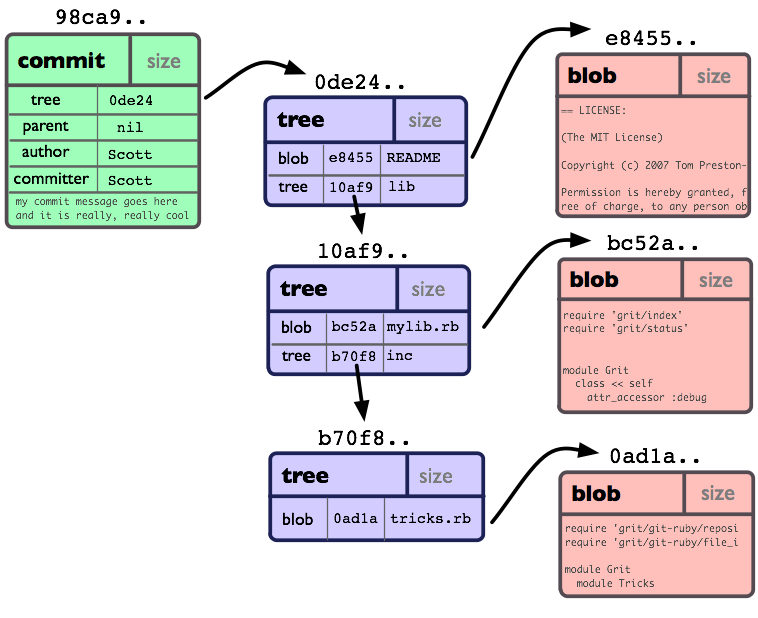

#极速入门Git and Hub :)
>个人肤浅理解，初学笔记，不正确的地方望指正。--[BCOTM](https://github.com/bcotm)

##0x00 什么是Git, Github?

**`Git`**听说是个**分布式**，**版本控制**系统。

从字面上看，**版本控制**好像可以解决`X文档终极版.doc`、`X文档终极版修改.doc`这样的问题，Git通过把文件放到一个叫**`仓库(Repository)`**的东西里来管理(像稻谷堆在谷仓里)。

**分布式**就是各处有很多备份，各个仓库之间可以方便联系？暂且这样想咯。

**`Github`**听说是*全球最大同性交友平台*。它提供免费的public仓库和交友的平台。这个**社交平台**大概长这个样子(图片源于网络，纯属娱乐)：

扯多了就不极速了，各种地方可以看介绍。[Git官网](https://git-scm.com/), [Github官网](https://github.com), [Google](https://www.google.com/)。

##0x01 极速Git

###Git三个工作区域

Git是怎么管理文件的版本的呢？Git在仓库和当前工作目录中间加了一个暂存区，而且仓库里保存了全部历史文件的**快照**。这样也就可以任意的更换文件的版本咯(只要把想要的文件版本换出来就可以了吗)。绝大部分操作一般只往Git的数据库里添加数据，所以它们都"可逆"。大概长这个样子(先别仔细看)：

还有一个不错的网站(各个命令和状态的关系):[Git Cheetsheet](http://ndpsoftware.com/git-cheatsheet.html)

工作目录上的可逆通过**`暂存区`**来实现。比如在工作区中修改了某个文件，先将修改添加`add`到暂存区，如果想撤回这些修改，我不还没放到仓库里吗，直接从仓库里拿出来`checkout HEAD`就可以将工作区和暂存区里文件还原到之前的样子了。要是我还没`add`呢，那不直接从暂存区`checkout`就行了。在工作区删除了文件想恢复？也是同样的道理。大概就是在这三个地方换来换去(写的命令是什么鬼 - -)。

###Git对象模型

那仓库里的可逆是怎么实现的呢？只知道它存了一堆快照，我怎么去访问这堆东西呢。这就得说说 Git 内部的几个对象了(暂时不管Tag对象)。有点像这样：

**对象名**  所有用来表示历史信息的文件都通过40个字符(SHA-1值)来索引。像这样：`6ff87d4664981e439762579ac8ea3bcb5f2279a3`

**Blob对象**  用来存储文件内容，就是一块二进制数据。

**Tree对象**  相当于目录，存了一堆指针，指向tree或blob。

**Commit对象**  指向一个tree对象，还有相关描述信息(作者，committer)。每个commit对象还指向一个父节点，上次提交对象，这样就构成一串一串的commit对象，就是这个仓库的提交历史。

###Git分支

这一串一串的提交对象就像分支一样。Git 的分支，其实本质上仅仅是指向提交对象的可变指针。 Git 的默认分支名字是 master ，它会在每次的提交操作中自动向前移动。Git又是怎么知道当前在哪一个分支上呢？也很简单，它有一个名为 HEAD 的特殊指针。大概像这样：

使用分支意味着可以把工作从开发主线上分离开来，以免影响开发主线。使各个分支线互不影响，最后再把工作合并到一起。有的分支策略像这样：

那么 Git 又是怎么分布式的呢？就是一堆的仓库放在不同的地方。那我要怎么联系远程的仓库呢？先和它谈好我们交流的协议(https, ssh, git, file...)，从远程仓库`clone`一份过来。本地和远程之间的交互就是`push`和`pull`推过去拉过来的。想要管理远程的仓库,还有`remote`。当然，其实远程仓库无非又是一个刚才讲的那个样子的仓库。也有几个工作区，一堆对象，多条分支什么的。有点像下面这样：

说到分支，那远程的分支和本地的分支怎么联系呢。这就要提到本地分支，跟踪分支和远程分支了。 Git 在`clone`了远程仓库后，默认把它叫做**origin**，它不也有默认的**master**分支吗，在使用命令的时候**origin/master**就代表了远程上的master分支。其实`clone`的时候就默认把本地的 master 分支和远程的 master 分支(origin/master)建立了跟踪的关系，当然也可以自己设置。这样推过去拉过来的时候就不用说明本地和远程到底是哪两个分支在交互了。(分支相关的命令有`branch`,`checkout`等等)

那么，现在大概能回顾一下：

##0x02 极速Github

前面提到 Github 是一个提供免费public仓库和交友平台的地方。那么我就可以在 Github 上创建自己的远程仓库和看别人仓库里的东西咯。如果是像我这样的熊孩子(水平比较低)，别人可不想仓库里的东西被我随便修改。于是 Github 这样安排了一下：

让仓库的维护者可以直接`push`进去，而其他人则只能从仓库`fork`一份到自己的public仓库里，然后`clone`,`fetch`,`pull`到本地。如果其他人想要贡献自己的力量，可以给仓库的维护者提一个`Pull Request`，让他们考虑是否加入到仓库了。
